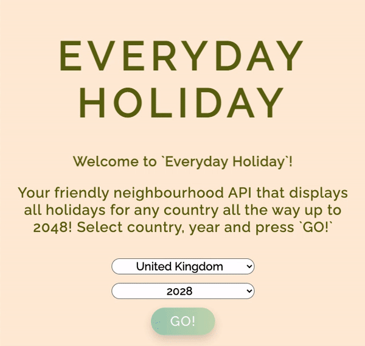

 
### General Assembly, Software Engineering Immersive 

# Everyday Holiday 
By [Guy Kozlovskij](https://github.com/guykozlovskij) and [Dimitar Tsonev](https://github.com/D-Tsonev).

## Table of Contents
* [Overview](#overview)
* [Brief](#brief)
* [Technologies Used](#technologies)
* [Approach](#approach)
* [The App](#app)
  * [Router](#router)
  * [Requests](#requests)
  * [Homepage](#homepage)
    * [Country Select](#country-select)
    * [GO!](#go)
  * [Holiday Display](#holiday-display)
    * [URL Parameters](#url-params)
    * [Holiday Card](#holiday-card)
* [Challenges](#challenges)
* [Victories](#victories)
* [Lessons Learned](#lessons-learned)

<a name="overview"></a>

## Overview  
A two-day paired project as part of the Software Engineering Immersive course at General Assembly. The goal was to build a React app that consumes a public API. 

We chose to create an app showing all national holidays for a selected country and year using Calendarific API. The app was deployed using Netlify and can be viewed [here](https://guykozlovskij-project-2.netlify.app/).

<a name="brief"></a>

## Brief
- Consume a public API
- Have several components - at least one classical and one functional
- Stick with KISS (Keep It Simple Stupid) and DRY (Don't Repeat Yourself) principles
- Project deployed online and accessible to the public
- Have semantically clean HTML 

<a name="technologies"></a>

## Technologies Used
- HTML5
- React
- CCS3
- JavaScript (ES6)
- Git and GitHub
- NPM 
- VSCode Live Share 

<a name="approach"></a>

## Approach 
Our goal was to create a simple, straightforward app that will display all holidays for a selected country with the accurate date based on a selected year, which we designed with a clean minimalist approach. As this was our first project using React, after having studied it for two weeks, our goal was to ensure we understand how to correctly pass data within components and to display correct output from the API. We worked collaboratively using VSCode Live Share and planned out our MVP in Ziteboard. 

The website is mobile-friendly and accessible through the web browser.

<a name="app"></a>

## The App

<a name="router"></a>

### Router
Our website has two main components: the homepage and holiday-display page which are routed in `App.js` using `<BrowserRouter>`.

```js
function App() {
  return (
    <Router>
      <Switch>
        <Route exact path="/" component={Home} />
        <Route path="/holidays/:id/:year" component={HolidayDisplay} />
      </Switch>
    </Router>
  )
}
```

<a name="requests"></a>

### Requests
We implemented two requests handled in `api.js` using axios `get` methods: 
<a name="request"></a>

```js
export function getAllCountries(){
  return axios.get('https://calendarific.com/api/v2/countries?api_key=aad5de35593f48602bc3a0b1908fe764e122af32')
}

export function getSingleCountry(id, year) {
  return axios.get(`${holidayUrl}&country=${id}&year=${year}`)
}
```

We retrieve the `id` and `year` required for `getSingleCountry` request in the `HolidayDisplay` component from the URL (see [here](#params)).

<a name="homepage"></a>

### Homepage 

<a name="country-select"></a>

#### Country Select


The homepage starts with a friendly introduction screen displaying two dropdown boxes to select the country and the year. 

As soon as the page is loaded a GET request is made to get the list of all countries within the API. The response is then stored in the `setCountries` variable.

```js
const [countries, setCountries] = React.useState(null)

React.useEffect(() => {
  const getData = async () => {
    try {
      const response = await getAllCountries()
      setCountries(response.data)
    } catch (error) {
      setIsError(true)
    }
  }
  getData()
}, [setIsError])
```

The values are then mapped through `select` tag and an `option` is created for each of the countries.
```js
<select onChange={handleSelect} value={selectedCountry}>
            <option value="" disabled selected>
              Select Country
            </option>
            {countries ? (
              // iso-3166 is the country ID.
              countries.response.countries.map((country) => (
                <option key={country.country_name} value={country['iso-3166']}>
                  {country.country_name}
                </option>
              ))
            ) : (
              <option value="" disabled selected>
                ...Loading
              </option>
            )}
          </select>
```

The select options then hold the country ID (iso-3166) as their `value` which is later passed used in the URL. 

<a name="go"></a>

#### GO!
If both the country and the year have been selected, a 'GO!' button is then displayed. 

```js
{selectedYear && selectedCountry ? (
  <Link to={`/holidays/${selectedCountry}/${selectedYear}`}>
    <button>GO!</button>
  </Link>
) : (
  <strong></strong>
)}
```


The button is wrapped in a `<Link>` tag accepting `selectedCountry` and `selectedYear` variables in the URL pathway. The values for these are retrieved in two select handlers called on both of the select boxes.

```js
const [selectedCountry, setSelectedCountry] = React.useState('')
const [selectedYear, setSelectedYear] = React.useState('')

const handleSelect = (e) => {
  setSelectedCountry(e.target.value)
}
const handleSelectedYear = (e) => {
  setSelectedYear(e.target.value)
}
```
<a name="holiday-display"></a>

### Holiday Display 

<a name="url-params"></a>

#### URL Parameters 
Once the 'GO!' button is clicked we are taken to the holiday-display page. 

<a name="params"></a>
Using `useParams` we retrieve the country ID and the year and pass it to the `getSingleCountry` request which accepts `id` and `year` as it's parameters (see the API request [here](#request)).

Response is the stored in the `singleCountry` variable.

```js
const { id, year } = useParams()
  const history = useHistory()
  const [singleCountry, setSingleCountry] = React.useState(null)

React.useEffect(() => {
  const getData = async () => {
    const response = await getSingleCountry(id, year)
    setSingleCountry(response.data)
    console.log(response)
  }
  getData()
}, [id, year])
```
<a name="holiday-card"></a>

#### Holiday Card
If the response is true, we then map through `singleCountry` and create a 'HolidayCard' which lists the name of the holiday, date of when it is held (reflecting the selected year) and the description of the holiday. 

```js
<section className="HolidayCard">
        <button onClick={handleBack}>Back</button>
        {singleCountry ?
          (<button onClick={handleBack}>Back</button>) && (
            singleCountry.response.holidays.map((holiday) => (
              <div className="holiday-view" key={holiday.name}>
                <h3>{holiday.name}</h3> 
                <h5>{holiday.date.datetime.day}/{holiday.date.datetime.month}/{holiday.date.datetime.year}</h5>
                <h4>{holiday.description}</h4>
              </div>
            ))) 
          : 
          (<p>... Loading holidays </p>)}
      </section>
```



<a name="challenges"></a>

## Challenges
As the API was split into two sections, one to first get all the countries, and second to get a specific country's holidays, the challenge was understanding the API and correctly passing the selected country ID which is retrieved first in the homepage, combining it with the selected year ensuring the correct result is shown in the holiday-display page. 

<a name="victories"></a>

## Victories
We had an option to use Bulma for this project, however we wanted to use this opportunity to also practice CSS. Despite the very limited time, and this being our first React project consuming a public API, we are happy with the final result and the look of our website. 

<a name="lessons-learned"></a>

## Lessons Learned
We spent a long time trying to pass the URL parameters between components in different ways without any success, however eventually realized there is a very elegant and simple solution using `useParams`. This was a big relief and a win and taught us the value of  reading documentation and doing a good amount of research to find a solution for a problem rather than trying to create on on our own. As this was our very first React project which we had to complete in 48 hours we are very happy with the result and what we have learned.
